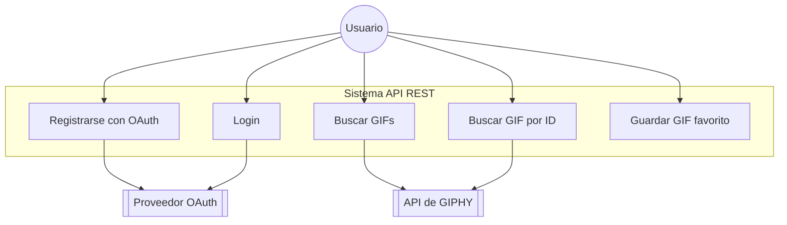
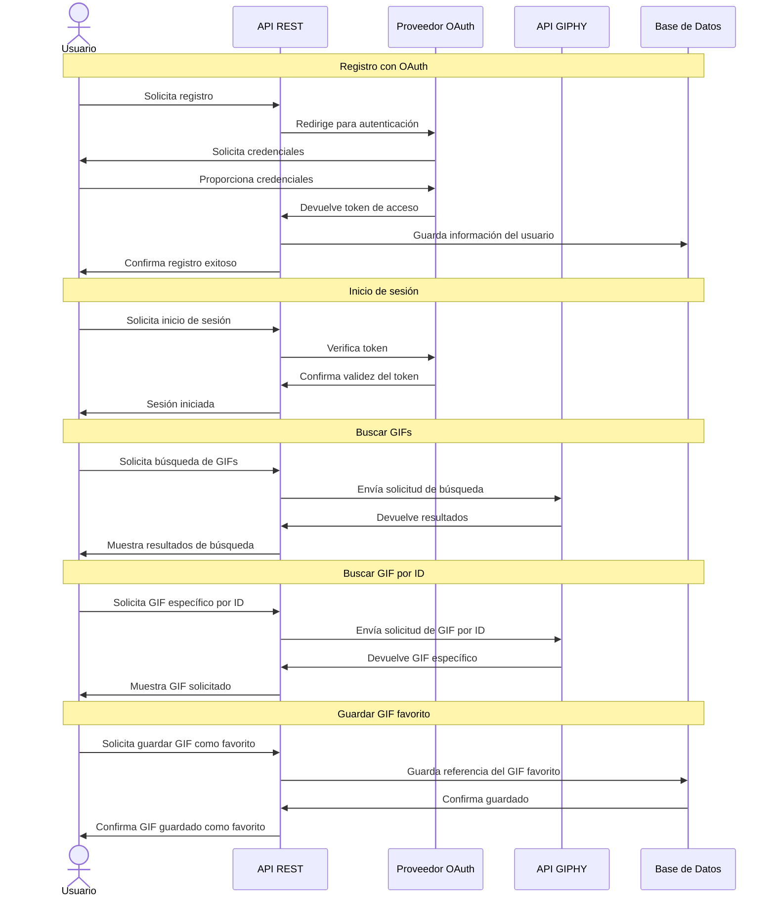

<p align="center"></p>


## Giphy Bookmarks Challege

El desafío es integrarse a una API existente y desarrollar una API REST propia que exponga un conjunto de servicios. Asimismo se
deberán entregar distintos diagramas que representen la solución.

Para la atentiacion de OAuth2.0 se utilizo la libreria [Laravel Passport](https://laravel.com/docs/11.x/passport).


## Requisitos

- PHP 8.2+
- Laravel 10.x+
- MySQL/MariaDB/TiDB
- Composer


## Como ejecutar el proyecto con docker

Este proyecto cuenta con la herramienta de sail que nos pemitira ejecutar el proyecto en con doker. Para ello debemos ejecutar los siguientes comandos:

1 -  clonar el repositorio

```bash
git clone https://github.com/andres-torres/giphy-bookmarks.git 
```

2 - entrar al directorio del proyecto

```bash
cd giphy-bookmarks 
```
3 - Instalacion de dependencias PHP

```bash
    composer install
```


3 - Para lanzar el proyecto en docker debemos ejecutar los siguientes comandos:

```bash
./vendor/bin/sail up -d
```

4 - Corremos los migrates de bases de datos

```bash
./vendor/bin/sail artisan migrate
```

5 - Implementación de OAuth2 en la API usando Laravel Passport
Para agregar una capa de autenticación y autorización basada en OAuth2 a la API, hemos utilizado Laravel Passport. Esta es una librería oficial de Laravel que proporciona todas las funcionalidades necesarias para manejar el protocolo OAuth2, permitiendo que los usuarios autentiquen y autoricen el acceso a recursos de manera segura.
Para simplificar las pruebas locales durante el desarrollo de la API, es posible generar un cliente personal que actúe como un cliente local para realizar pruebas sin requerir la creación de un flujo completo de OAuth2 con autorización y autenticación de terceros.

El siguiente comando permite generar un cliente personal utilizando Laravel Passport:
```bash
./vendor/bin/sail artisan passport:client --personal -n
```


## Diagrama de Casos de Uso




### Explicación del diagrama de casos de uso actualizado:

1. **Actor**
    - Usuario: Representa a cualquier usuario de la API. Ya no hay un rol de administrador.
2. **Casos de Uso**
    - Registrarse con OAuth: Los usuarios pueden registrarse en el sistema utilizando un proveedor OAuth.
    - Iniciar sesión: Los usuarios pueden iniciar sesión en el sistema, también utilizando OAuth.
    - Buscar GIFs: Los usuarios pueden buscar GIFs utilizando palabras clave.
    - Buscar GIF por ID: Los usuarios pueden buscar un GIF específico utilizando su ID.
    - Guardar GIF favorito: Los usuarios pueden guardar GIFs como favoritos.
3. **Sistema API REST**: Este subgrafo representa el límite de tu sistema API REST en Laravel.
4. **API de GIPHY**: Se muestra como un sistema externo con el que interactúan los casos de uso de búsqueda de GIFs.
5. **Proveedor OAuth**: Se muestra como un sistema externo que maneja el registro y la autenticación de usuarios.


## Diagrama de Secuencia - API REST Laravel con GIPHY y OAuth



Explicación del diagrama de secuencia:

1. **Registro con OAuth**:

    - El usuario solicita registrarse en la aplicación.
    - La API redirige al usuario al proveedor OAuth para autenticación.
    - El usuario proporciona sus credenciales al proveedor OAuth.
    - El proveedor OAuth devuelve un token de acceso a la API.
    - La API guarda la información del usuario en la base de datos.
    - Se confirma el registro exitoso al usuario.

2. **Inicio de sesión**:

    - El usuario solicita iniciar sesión.
    - La API verifica el token con el proveedor OAuth.
    - El proveedor OAuth confirma la validez del token.
    - La API confirma la sesión iniciada al usuario.


3. **Buscar GIFs**:

    - El usuario solicita una búsqueda de GIFs pasando el identificador de giphy ID.
    - La API envía la solicitud de búsqueda a la API de GIPHY.
    - GIPHY devuelve los resultados de la búsqueda.
    - La API muestra los resultados al usuario.


4. **Buscar GIF por ID**:

    - El usuario solicita un GIF específico por su ID.
    - La API envía la solicitud a la API de GIPHY.
    - GIPHY devuelve el GIF específico.
    - La API muestra el GIF solicitado al usuario.


5. **Guardar GIF favorito**:

    - El usuario solicita guardar un GIF como favorito.
    - La API guarda la referencia del GIF favorito en la base de datos.
    - La base de datos confirma el guardado.
    - La API confirma al usuario que el GIF se ha guardado como favorito.


## Utilizacon de un Middleware para realizar el logeo de las solicitudes
Descripción
El middleware Logger es responsable de interceptar cada solicitud entrante a la API y las respuestas de la misma.
y pupula los registros en la tabla de logs con los siguientes datos:

- **user_id:** El identificador del usuario que realiza la solicitud.
- **service:** El nombre del servicio o endpoint solicitado.
- **request:** El contenido de la solicitud realizada (normalmente en formato JSON).
- **status:** El estado de la respuesta (por ejemplo, códigos HTTP como 200, 400, 500).
- **response:** El contenido de la respuesta devuelta por la API (normalmente en formato JSON).
- **ip:** La dirección IP desde la cual se realizó la solicitud.


### Implementación
El middleware Logger debe ser registrado en el archivo bootstrap/app.php, en la sección de middlewares globales o asignado a rutas específicas dentro del grupo de rutas de la API.
```php
    ->withMiddleware(function (Middleware $middleware) {
        $middleware->use([
            \App\Http\Middleware\Logger::class
        ]);
    })
```


## Solicitudes mediante Postman

En esta sección se proporcionan ejemplos de cómo interactuar con la API utilizando Postman.
Se pude importar la coleccion de solicitudes y respuestas en Postman, que se encuentra en el archivo [postman-collection.json](postman-collection.json) dentro del directorio /docs.
 
### Variables de Entorno de postman

Antes de realizar las solicitudes, asegúrate de haber definido las siguientes variables de entorno en Postman:

* **{{baseUrl}}:** La URL base de la API (por ejemplo, https://api.example.com).
* **{{access_token}}:** El token de acceso que se obtiene tras realizar el login exitoso en la API.

1. Registro de Usuario (POST /api/register)
    - Crea un nuevo usuario en el sistema.
    
    Request:
    ```json
        POST {{baseUrl}}/api/register
        Headers:
            Accept: application/json
            User-Agent: Postman
        Body (JSON):
        {
        "name": "test",
        "email": "test@mail.com",
        "password": "12345678",
        "password_confirmation": "12345678"
        }
    ```

2. Inicio de Sesión (POST /api/login)
    - Autentica al usuario y devuelve un **access_token** que se utilizará para futuras solicitudes.
    
    Request:
    ```json
        POST {{baseUrl}}/api/login
        Headers:
            Accept: application/json
            User-Agent: Postman
        Body (JSON):
        {
        "email": "test@mail.com",
        "password": "12345678"
        }
    ```
    Reponse:
    ```json
    {
        "access_token": "your_generated_access_token",
        "token_type": "Bearer",
        "expires_in": 3600
    }
    ```

3.  Buscar Gifs (GET /api/gifs/search)
    - Busca gifs utilizando parámetros como query, limit y offset. Esta solicitud requiere autenticación mediante un token.
    
    Request:
    ```json
        GET {{baseUrl}}/api/gifs/search?query=french+bulldog&limit=5&offset=0
        Headers:
            Accept: application/json
        Auth:
            Bearer Token: {{access_token}}
    ```

4.  Obtener Gif por ID (GET /api/gifs/{id})
    - Obtiene un gif específico por su ID. También requiere autenticación.
    
    Request:
    ```json
    GET {{baseUrl}}/api/gifs/SGyomzniJko5W
    Headers:
        Accept: application/json
    Auth:
        Bearer Token: {{access_token}}

    ```

5. Agregar Gif a Favoritos (POST /api/gifs/favorites)
    - Agrega un gif a la lista de favoritos del usuario autenticado.
    
    Request:
    ```json
        POST {{baseUrl}}/api/gifs/favorites
        Headers:
            Accept: application/json
            User-Agent: Postman
        Auth:
            Bearer Token: {{access_token}}
        Body (JSON):
        {
            "id": "YMSfsfnvQ1MFuLv5M8",
            "alias": "Alias",
            "user_id": 1
        }

    ```   

