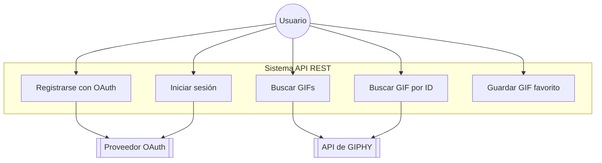

<p align="center"></p>


## Giphy Bookmarks Challege

El desafío es integrarse a una API existente y desarrollar una API REST propia que exponga un conjunto de servicios. Asimismo se
deberán entregar distintos diagramas que representen la solución.

Para la atentiacion de OAuth2.0 se utilizo la libreria [Laravel Passport](https://laravel.com/docs/11.x/passport).


## Requisitos

- PHP 8.2+
- Laravel 10.x+
- MySQL/MariaDB/TiDB
- Composer


## Como ejecutar el proyecto con docker

Este proyecto cuenta con la herramienta de sail que nos pemitira ejecutar el proyecto en con doker. Para ello debemos ejecutar los siguientes comandos:

```
docker-compose up -d
```


### Diagrama de Casos de Uso

### Premium Partners

- **[Vehikl](https://vehikl.com/)**
- **[Tighten Co.](https://tighten.co)**
- **[WebReinvent](https://webreinvent.com/)**
- **[Kirschbaum Development Group](https://kirschbaumdevelopment.com)**
- **[64 Robots](https://64robots.com)**
- **[Curotec](https://www.curotec.com/services/technologies/laravel/)**
- **[Cyber-Duck](https://cyber-duck.co.uk)**
- **[DevSquad](https://devsquad.com/hire-laravel-developers)**
- **[Jump24](https://jump24.co.uk)**
- **[Redberry](https://redberry.international/laravel/)**
- **[Active Logic](https://activelogic.com)**
- **[byte5](https://byte5.de)**
- **[OP.GG](https://op.gg)**

## Contributing

Thank you for considering contributing to the Laravel framework! The contribution guide can be found in the [Laravel documentation](https://laravel.com/docs/contributions).

## Code of Conduct

In order to ensure that the Laravel community is welcoming to all, please review and abide by the [Code of Conduct](https://laravel.com/docs/contributions#code-of-conduct).

## Security Vulnerabilities

If you discover a security vulnerability within Laravel, please send an e-mail to Taylor Otwell via [taylor@laravel.com](mailto:taylor@laravel.com). All security vulnerabilities will be promptly addressed.
