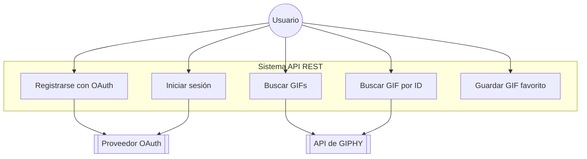

<p align="center"></p>


## Giphy Bookmarks Challege

El desafío es integrarse a una API existente y desarrollar una API REST propia que exponga un conjunto de servicios. Asimismo se
deberán entregar distintos diagramas que representen la solución.

Para la atentiacion de OAuth2.0 se utilizo la libreria [Laravel Passport](https://laravel.com/docs/11.x/passport).


## Requisitos

- PHP 8.2+
- Laravel 10.x+
- MySQL/MariaDB/TiDB
- Composer


## Como ejecutar el proyecto con docker

Este proyecto cuenta con la herramienta de sail que nos pemitira ejecutar el proyecto en con doker. Para ello debemos ejecutar los siguientes comandos:

1 -  clonar el repositorio

```bash
git clone https://github.com/andres-torres/giphy-bookmarks.git 
```

2 - entrar al directorio del proyecto

```bash
cd giphy-bookmarks 
```
3 - Instalacion de dependencias PHP

```bash
    composer install
```


3 - Para lanzar el proyecto en docker debemos ejecutar los siguientes comandos:

```bash
./vendor/bin/sail up -d
```

4 - Corremos los migrates de bases de datos

```bash
./vendor/bin/sail artisan migrate
```

### Diagrama de Casos de Uso


